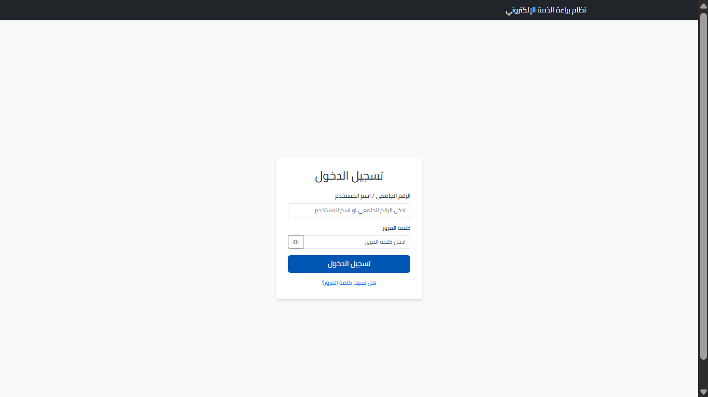

# University Clearance System


> A graduation project that automates the university clearance process, transforming it into a fully electronic system to simplify procedures for students and staff.

---

## 📖 About
The **University Clearance System** is a web application designed to solve the problem of paperwork and bureaucracy in universities. The system allows students to submit a clearance request in a single step through their account, and enables various departments (Library, Finance, Dormitories, etc.) to process requests electronically. It provides dedicated dashboards for each role (Student, Officer, Admin) with a real-time notification system to ensure efficient communication.

## 📸 Screenshots
> *Screenshots from the actual system in operation.*

### 🔐 Login Page


### 📊 Dashboards
| Student Dashboard | Department Officer Dashboard |
| :---: | :---: |
|  |  |
| *Status Tracking* | *Request Management* |

### 🛡️ System Administration
| Statistics & Analytics | User Management |
| :---: | :---: |
|  |  |
| *System Overview* | *Control Users* |

## ✨ Features
*   **Role-Based Access Control (RBAC):** (Student, Department Officer, System Administrator).
*   **Real-time Notifications (Web Push):** Instant browser alerts when status updates occur.
*   **Document Generation:** Generate a printable PDF clearance certificate upon approval.
*   **Seamless User Experience:** Interface supports Arabic (RTL) and is mobile-responsive.
*   **Statistical Dashboard:** Charts displaying completion rates and department workload.

## 🛠️ Tech Stack
*   **Backend:** Python 3, Flask
*   **Database:** SQLite (SQLAlchemy ORM)
*   **Frontend:** Bootstrap 5, Jinja2, JavaScript
*   **Authentication:** Flask-Login
*   **Notifications:** VAPID / PyWebPush

## 🚀 Installation & Setup

1.  **Clone the Repository:**
    ```bash
    git clone https://github.com/fahdaljumaili/clearance_system.git
    cd clearance_system
    ```

2.  **Set Up Virtual Environment:**
    ```bash
    python -m venv venv
    venv\Scripts\activate   # Windows
    # source venv/bin/activate  # Mac/Linux
    ```

3.  **Install Dependencies:**
    ```bash
    pip install -r requirements.txt
    ```

4.  **Generate Keys (Setup):**
    ```bash
    python setup_env.py
    ```

5.  **Run the Application:**
    ```bash
    python run.py
    ```
    Open your browser at: `http://localhost:5000`

