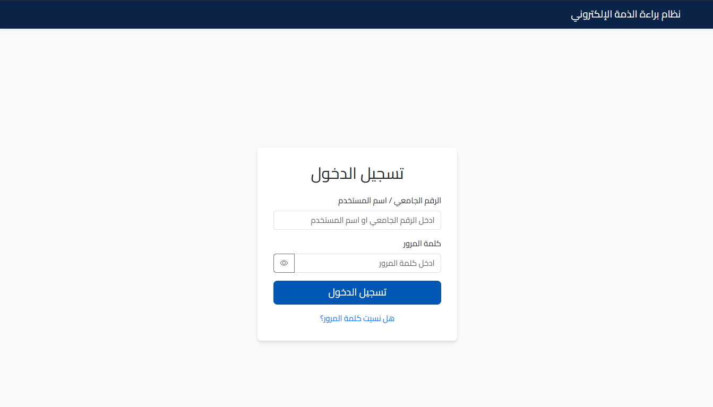

# University Clearance System


> A graduation project that automates the university clearance process, transforming it into a fully electronic system to simplify procedures for students and staff.

---

## 📖 About

The **University Clearance System** is a web application designed to solve the problem of paperwork and bureaucracy in universities. The system allows students to submit a clearance request in a single step through their account, and enables various sections (College Library, Student IDs, Registration, etc.) to process requests electronically. It provides dedicated dashboards for each role (Student, Section Head, System Administrator) with a real-time notification system to ensure efficient communication.

## 📸 Screenshots

> _Screenshots from the actual system in operation._

### 🔐 Login Page



### 📊 Dashboards

|                        Student Dashboard                        |                                     Section Head Dashboard                                     |
| :-------------------------------------------------------------: | :--------------------------------------------------------------------------------------------: |
|  |  |
|                        _Status Tracking_                        |                                 _Request Management (Filters)_                                 |

### 🛡️ System Administration

|                                           Statistics & Analytics                                            |                                           User Management                                            |
| :---------------------------------------------------------------------------------------------------------: | :--------------------------------------------------------------------------------------------------: |
|  |  |
|                                              _System Overview_                                              |                                           _Control Users_                                            |

## ✨ Features

- **Role-Based Access Control (RBAC):** (Student, Section Head, System Administrator).
- **Real-time Notifications (Web Push):** Instant browser alerts when status updates occur.
- **Advanced Filtering System:** Filter students and requests by College, Department, Stage, etc.
- **Excel Operations:** Import students from Excel with automatic strong password generation.
- **Document Generation:** Generate a printable clearance certificate upon approval.
- **Seamless User Experience:** Interface supports Arabic (RTL) and is mobile-responsive.
- **Statistical Dashboard:** Multi-dimensional charts displaying completion rates and department workload.

## 🛠️ Tech Stack

- **Backend:** Python 3, Flask
- **Database:** MySQL (SQLAlchemy ORM + PyMySQL)
- **Frontend:** Bootstrap 5, Jinja2, JavaScript
- **Authentication:** Flask-Login
- **Notifications:** VAPID / PyWebPush

## 🚀 Installation & Setup

1.  **Clone the Repository:**

    ```bash
    git clone https://github.com/fahdaljumaili/clearance_system.git
    cd clearance_system
    ```

2.  **Set Up Virtual Environment:**

    ```bash
    python -m venv venv
    venv\Scripts\activate   # Windows
    # source venv/bin/activate  # Mac/Linux
    ```

3.  **Install Dependencies:**

    ```bash
    pip install -r requirements.txt
    ```

4.  **Generate Keys (Setup):**

    ```bash
    python setup_env.py
    ```

5.  **Run the Application:**
    ```bash
    python run.py
    ```
    Open your browser at: `http://localhost:5000`
